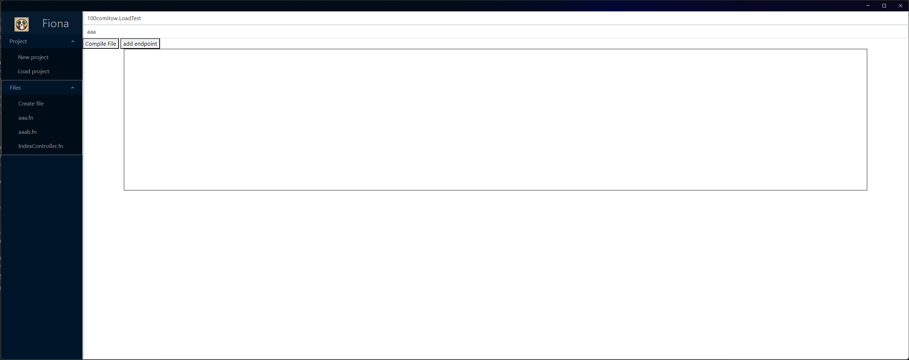
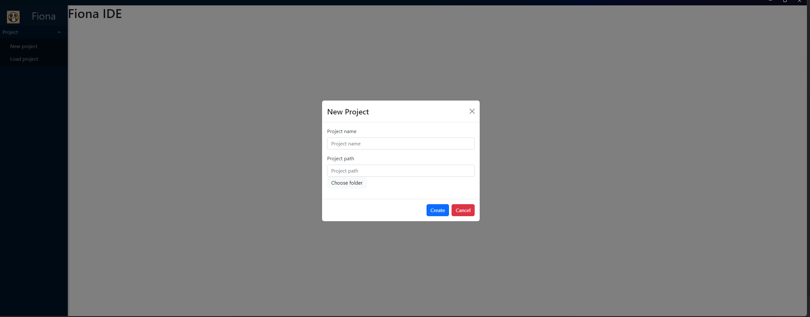
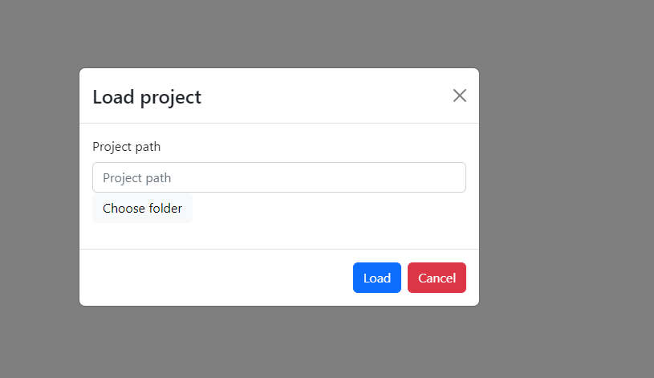

# Blueprints

This feature is under develop

This is how it's look now (at the end of the competition)

I know it's not much, but working with new technology(blazor) defeated me

## Create project

1. Click button `New Project`
2. Fill up form
   

## Load project

1. Click button `Load project`
2. Choose folder with fsln file
3. 

## Add file

After open project you can create file in two ways.

1. Click button `Create file` or just right-click on your mouse, then from context menu click `Create file`
2. Then you have to fill up form

!! There is a problem when the pop-up window shows one of the boxes from the diagram, you cannot fill in the entered
text, you need to resize the main window so that popup it is outside the box

## Remove file
To remove the file you just have to right-click on the file in the left menu, then select `Remove file` from context menu